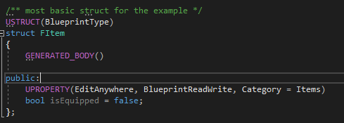
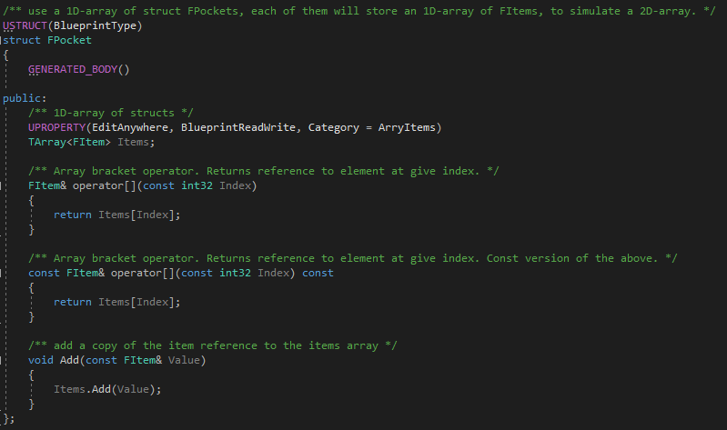
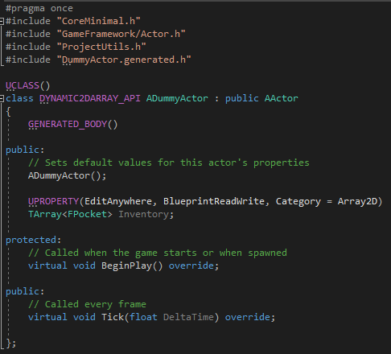
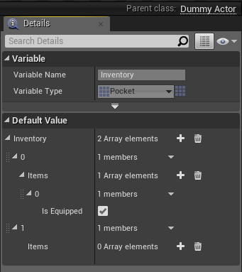
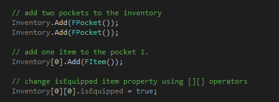
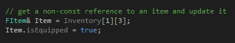
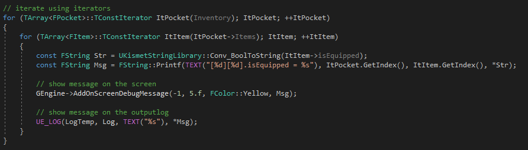
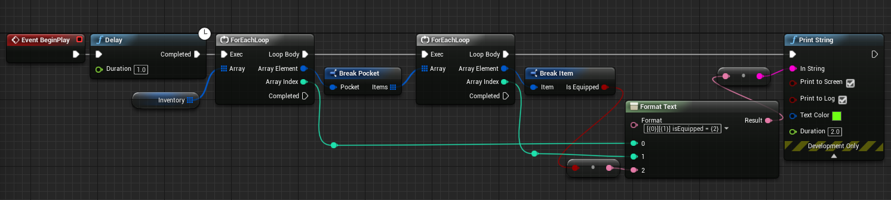

# Dynamic 2D Array using TArray

To simulate a 2D-array in Unreal Engine 4 to use in C++ and Blueprints, follow the next steps.

## Create an UStruct that stores a TArray<> of whatever structs, classes or primitives

## Add a "2D-array" to a dummy actor or another class you want

If you need it, expose the properties of the structs as UPROPERTY to see them in the Blueprints

## In C++ use operator[][] to access 2D-array properties

## Get references to 2D-array elements

## Iterate like a 2D-array in C++

## Iterate like a 2D-array in Blueprints

https://answers.unrealengine.com/questions/551199/dynamic-2d-array-using-tarray.html
