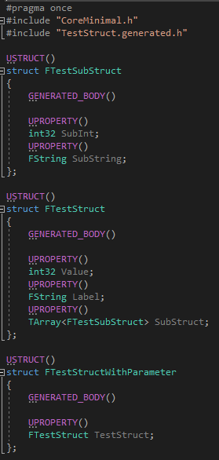
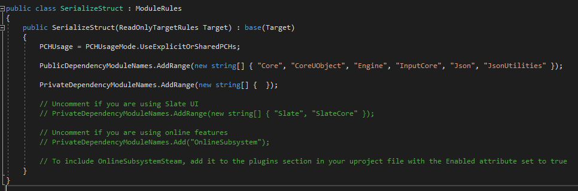
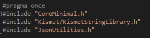
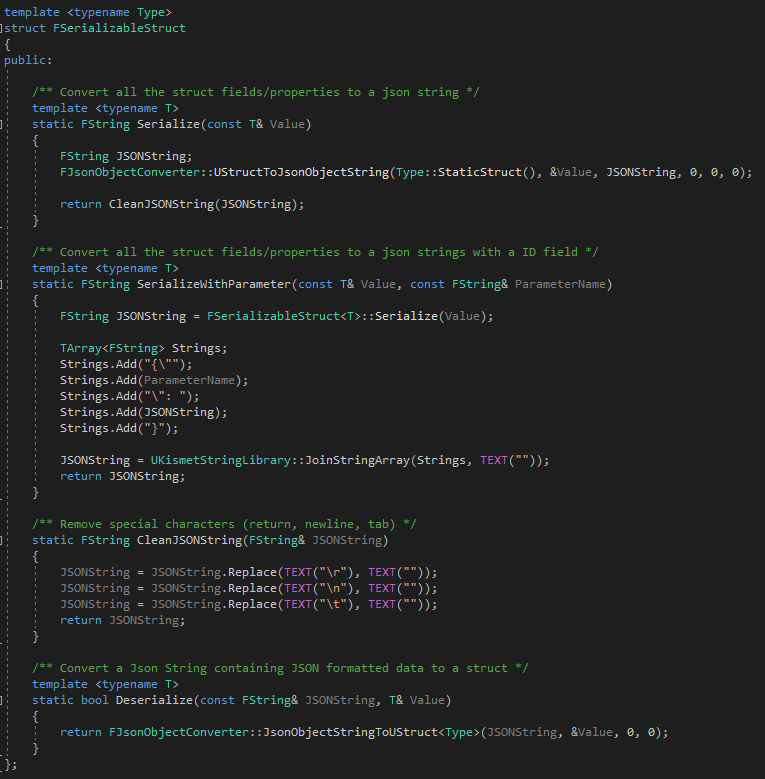
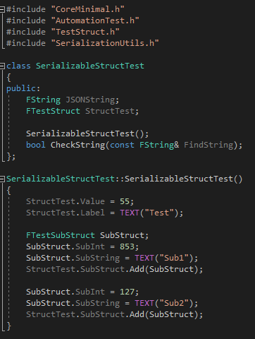
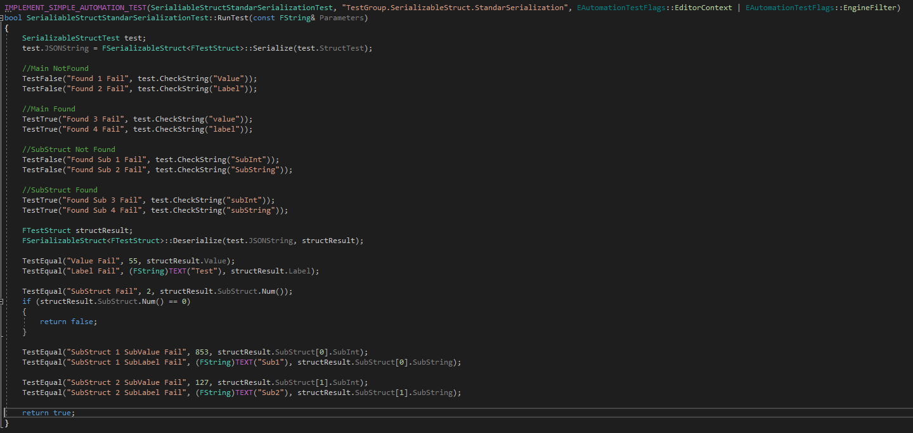
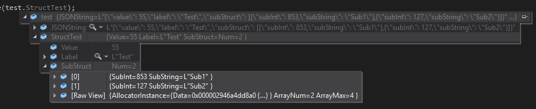
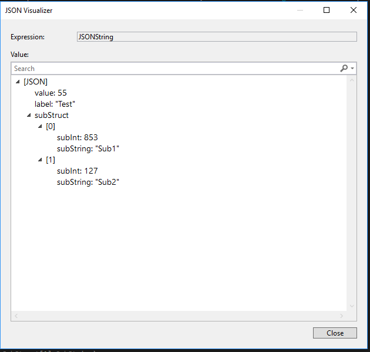
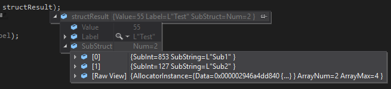
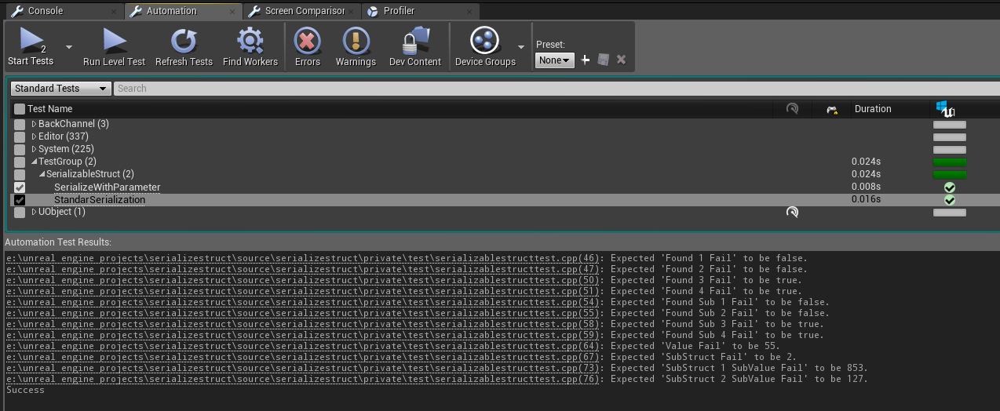

# Serializate UStructs and use Automation Tests in Unreal Engine 4

In this project we will serialize and deserialize structs within UE4 using JSON utilities, and then we will use the UE4 Automation Tests to verify that everything is correct.

## Serializate UStructs in Unreal Engine 4

Serialization is the process of translating data structures or object state into a format that can be stored or transmitted and reconstructed later. When the resulting series of bits is reread according to the serialization format, it can be used to create a semantically identical clone of the original object. Serialization of object-oriented objects does not include any of their associated methods with which they were previously linked.
This process of serializing an object is also called marshalling an object. The opposite operation, extracting a data structure from a series of bytes, is deserialization, also called unmarshalling.

https://en.wikipedia.org/wiki/Serialization

Many data storage systems use serialization to persist the state of objects in text strings with a specific format and syntax to make both serialization and deserialization processes easier. For example, the JSON format is used in PlayFab. Thus, a front-end system can request data from PlayFab's BBDD that returns them as JSON, and through a deserialization system we can transform it into an object, whose template we already have predefined.

Example:
-create some test structures, with basic properties (integers, floats, strings, arrays). Note that you have to mark all the variables that you want to serialize with the UPROPERTY macro:

-to use JSON utilities you need to add JSON and JSONUtilities modules to your projectname.Build.cs file:

-Then take a look to the template methods we will use to serialization and deserialization:

https://api.unrealengine.com/INT/API/Runtime/Json/Serialization/index.html
https://api.unrealengine.com/INT/API/Runtime/Json/Serialization/FJsonSerializer/index.html
https://api.unrealengine.com/INT/API/Runtime/JsonUtilities/FJsonObjectConverter/index.html
https://forums.unrealengine.com/development-discussion/c-gameplay-programming/1561415-solved-json-serializing-and-deserializing-c

## Automation Tests in Unreal Engine 4

-Since 4.17 automation test are moved to plugins. then goto editor, plugins and enable Tests

-check that the serialization process has been correct using the Automation tests. You need to create a "Test" folder in the Source/Private path 
and a fileName.cpp to make some test:

-create a dummy class that will fill our Struct with dummy data:

-implement simple automation test method:

-Debug project to check that the serialization from a UStruct to a JSONString is fine:

-Debug deserialization:

-launch your custom Automation Test:

https://docs.unrealengine.com/en-us/Programming/Automation
https://docs.unrealengine.com/en-us/Programming/Automation/TechnicalGuide
https://docs.unrealengine.com/en-us/Programming/Automation/UserGuide
